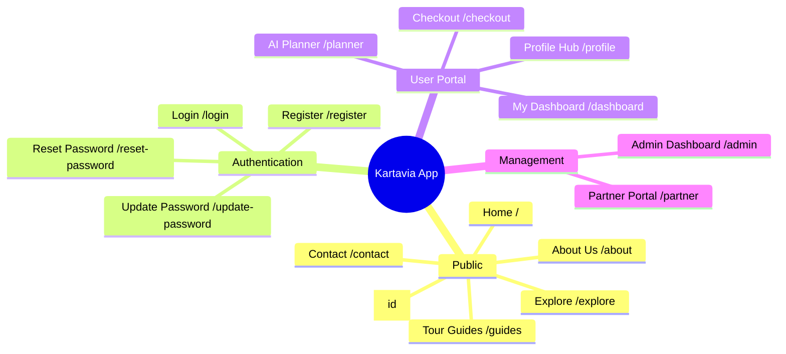
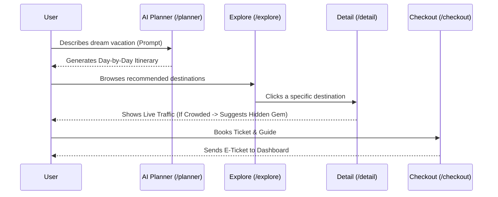

# 🗺️ Kartavia - Comprehensive Platform Sitemap

> **Kartavia** is a next-generation, AI-driven eco-tourism platform for Yogyakarta. This document serves as the architectural map of our platform's frontend routes, highlighting the user journey from exploration to booking, and covering all specialized portals (Admin & Partner).

---

## 🧭 Visual Architecture (Mindmap)

---

## 📂 Detailed Route Structure

### 1. 🌐 Public Facing (Guest Accessible)
These routes are designed for SEO optimization and initial user acquisition.
- **`/` (Home)**
  - Hero Section (Search & Quick Dates)
  - Promo & Deals Slider
  - Live Density Map (Real-time Overtourism Tracker)
  - Curated Culinary Highlights
- **`/explore` (Discover Destinations)**
  - Advanced Multi-filter Sidebar (Category, Region, Price, Eco-Friendly toggle)
  - Destination Grid with Live Traffic Status (Crowded / Moderate / Quiet)
- **`/detail/[id]` (Destination Deep Dive)**
  - Dynamic Header & Image Gallery
  - **Live Traffic Warning** & Smart Alternatives (Hidden Gems Recommender)
  - Zero Waste / Eco-Score Badge
  - Embedded Reviews & Interactive Maps
- **`/guides` (Tour Guides)**
  - List of certified local guides to empower the local economy.
- **`/about` & `/contact`**
  - Project vision, mission, and contact forms.

---

### 2. 🔐 Authentication & Security
Handled securely via Supabase Auth.
- **`/login`** - Seamless email/password & social login.
- **`/register`** - New user onboarding.
- **`/reset-password`** - Forgot password flow.
- **`/update-password`** - Secure password update form.

---

### 3. 👤 User Portal (Authenticated)
The core engine for personalized travel experiences.
- **`/planner` (Kartavia AI Trip Planner) ✨**
  - GenAI-powered itinerary builder. Users input their dream vacation, and the AI streams a day-by-day plan using RAG (Retrieval-Augmented Generation).
- **`/profile` (Premium Profile Hub)**
  - **Overview**: Asymmetrical Bento Grid showing *Green Points* and *Travel Style*.
  - **Personal Info**: Standard user data management.
  - **Travel Preferences**: Interest pills, dietary requirements, and accommodation style.
  - **Security**: Password management.
- **`/checkout` (Booking Engine)**
  - Multi-step secure checkout for tickets, guides, and rentals.
- **`/dashboard` (My Bookings)**
  - History of upcoming and past trips, e-tickets, and transaction receipts.

---

### 4. 🏢 Management & Operations (Role-Based)
Portals dedicated to platform administrators and local business partners.
- **`/admin` (Admin Control Center)**
  - **Destinations**: CRUD operations for tourist spots. Includes **AI Magic Fill** to auto-generate engaging descriptions.
  - **Users**: Manage access levels (User, Admin, Partner).
  - **Reports**: Overview of user-submitted "Citizen Waste Reports".
- **`/partner` (Local Business Portal)**
  - Dashboard for local vendors, homestays, and tour operators to manage their listings, monitor bookings, and validate tickets.

---

## 🔄 User Flow Diagram: The AI Planning Journey

---
*Document designed specifically for Kartavia's architectural presentation. Built with ♥️ for the future of smart eco-tourism.*
